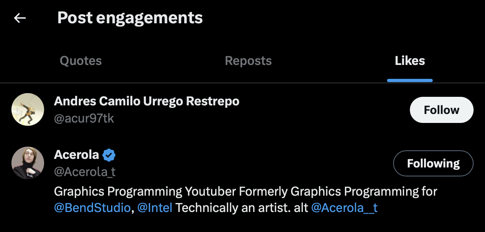

# My Shader Showcase Project Year 2023 Public Version
*Unity BIRP - Version 2021.3.16f1*  
THIS PROJECT WILL PROBABLY ONLY LAST FOR THE CURRENT YEAR ITS BEING WORKED ON.  
I plan on having a showcase project every year so this will probably be for the year of 2023 & a new project will come in 2024.  
*SHADER SHOWCASE 2024 HERE > https://github.com/j-2k/ShaderShowcase2024*

This is my project where I will hold many shaders that I have created & show them as a portfolio/showcase.  
This project will hold 2 showcase projects, I explain them below:  
- First part will showcase the Valorant dance effect from the radiant entertainment system with a bunch of my shaders I created & learned throughout the year for fun. This was mainly to re-learn particle effects & learn new shader techniques.  
- Second part will showcase some secret "quake" stuff let's just say that...

(I had to reupload? this repo due to some issues, so here we are... & thanks to the 2 stargazers :>)

# Videos out of this Project
  
Valorant Dance Project |  Learning Shell Texturing
:-------------------------:|:-------------------------:
[](https://www.youtube.com/watch?v=HFGB74eJgD0) | [](https://www.youtube.com/watch?v=P-vr9w1XpAY)

This project also contains MANY things not shown DIRECTLY! however, these were the biggest things in terms of what I enjoyed making a video out of.  
*EXAMPLE, fresnel is not shown DIRECTLY, BUT you can still see fresnel shaders in the valorant dance project video, there are many hidden small effects/easter eggs I put in that video!*

# Shaders currently featured
A lot of these shaders are incomplete but I will add more & finish them up when I prepare a final scene or if I ever need to showcase properly.
- Spherical Wrapping
- Dynamic Decal (Source/Valorant Sprays)
- Stencil Shader (Stencil has an illusion effect)
- Dynamic Moving Normals (Learning)
- Skybox Shader
- Outlines (Using Normals)
- Fresnel
- SDF Testing (Learning Signed Distance Fields)
- Mandelbrot Fractal Shader (Learning Fractals)
- Valorant Arcade Kill Effect (Dance Version)
- Various shaders relating to the Q1 Movement Sim
- Raymarching shader (learning)

# WIP Projects
- Arcade Kill Effect Video // Completed!
- Quake 1 Player Movement Video // Postponed
- Water Shader Scene Showcase // Postponed // to be done before the second project a part 1.5-type idea
- Shell Texture Shader Scene Showcase // Completed! //to be done before the second project a part 1.5-type idea?? maybe this will replace the water shader

# License?
Please be careful since I'm using ripped models from popular games. This isn't commercial just going to be for testing & making a video for fun out of it.

## My Personal Notes
I know this is late but I realized the formula is written on the bottom of the Wikipedia page for UV maps
insanely useful for spherically wrapped objects that need a sphere based UV map

https://en.wikipedia.org/wiki/UV_mapping
#### ***FIX FOR SKYBOX STRETCHING THROUGH SHADER CODE***
```
in vert shader:
o.worldPos = mul(unity_ObjectToWorld,v.vertex);

in frag shader:
float3 worldPos = normalize(i.worldPos);
float arcSineY = asin(worldPos.y)/(PI/2); //PI/2;
float arcTan2X = atan2(worldPos.x,worldPos.z)/TAU;
float2 skyUV = float2(arcTan2X,arcSineY);
```

## Shell Texture Shader (128 Textures)

Finished Shell Texturing project (Submitted for #acerolafurrychallenge)  
Twitter submission with video > [click here](https://x.com/jumaalremeithi/status/1725938324248867175?s=20)

<p float="left" align="middle">
  
   
</p>

<p float="left" align="middle">
  
    
</p>




# Acerola 🛐
The first like GIGACHAD & thanks to the other random guy :)  
My motivation for the video after seeing this 📈📈📈  
Will post my promised video when its done.  
*twitter post likes on my shell texturing video using the acerolafurrychallenge hashtag*
  
# Picture Dump


(2022-2023 Read me) First ever custom shader that looked decent  

https://user-images.githubusercontent.com/52252068/146339015-9a0d2fac-8d2b-4c9d-880d-235585fd0d4e.mp4

$$x=\frac{-b\pm\sqrt{b^2-4ac}}{2a}$$ $$a^2 + b^2 = c^2$$ 

$$R = R_x(\alpha) \cdot R_y(\beta) \cdot R_z(\gamma)$$

$$
R = \begin{bmatrix}
\cos(\gamma)\cos(\beta) & -\sin(\gamma)\cos(\alpha) + \cos(\gamma)\sin(\beta)\sin(\alpha) & \sin(\gamma)\sin(\alpha) + \cos(\gamma)\sin(\beta)\cos(\alpha) \\
\sin(\gamma)\cos(\beta) & \cos(\gamma)\cos(\alpha) + \sin(\gamma)\sin(\beta)\sin(\alpha) & -\cos(\gamma)\sin(\alpha) + \sin(\gamma)\sin(\beta)\cos(\alpha) \\
-\sin(\beta) & \cos(\beta)\sin(\alpha) & \cos(\beta)\cos(\alpha) \\
\end{bmatrix}
$$

Good to know after so much time wasted that mathjax is supported natively on MD & on GH-pages but needs only a import.

table header col 1 |  table header col 2
:-------------------------:|:-------------------------:
Table Test | Table Test (Image commented here in source >) <!---->

<p float="left" align="middle">
  
   
  
</p>

Progress Images 1 |  Progress Images 2 |  Progress Images 3
:-------------------------:|:-------------------------:|:-------------------------:
 | 
 | 3
